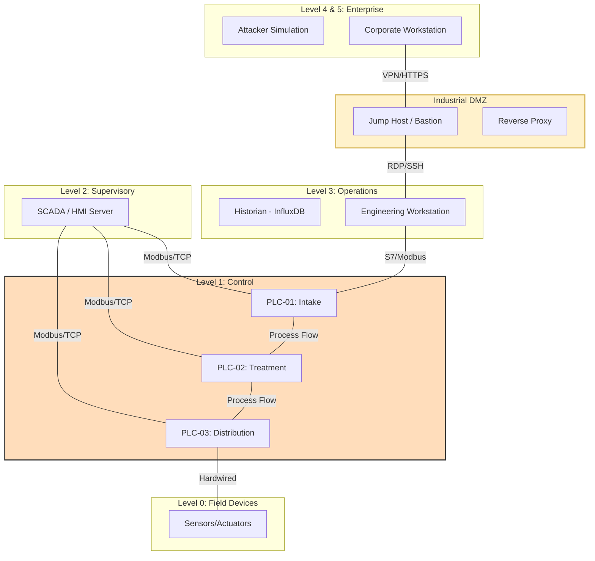

# OT-Security-Lab: Integrated Industrial Control System (ICS) Security Environment

[](./architecture/zone-conduit-design.md)
[](./threat-model/mitre-ics-mapping.md)

## Project Overview
This repository contains a full-scale, simulated industrial environment designed to demonstrate the implementation of robust security controls within an Operational Technology (OT) context. The project encompasses the entire lifecycle of an IT/OT Security Engineer's responsibilities: from **architectural design** and **network segmentation** based on the Purdue Model, to **threat modeling**, **detection engineering**, and **IEC 62443 compliance mapping**.

The lab simulates a **Water Treatment & Filtration Facility**, facilitating a hands-on platform for validating security configurations and detection rules against realistic ICS attack vectors.

---

## 2. Architecture: The Purdue Model
The environment is segmented into logical levels according to the **ISA-95 Purdue Model**, ensuring strict isolation of critical control processes.



### Purdue Levels Mapping:
*   **Level 4/5 (Enterprise):** Corporate LAN, Attacker Simulation, External Monitoring.
*   **Industrial DMZ:** Broker for remote access (Jump Host) and data visualization (Proxy).
*   **Level 3 (Operations):** Historian (InfluxDB) and the segregated Engineering Workstation (EWS).
*   **Level 2 (Supervisory):** Centralized SCADA/HMI (ScadaBR) for plant-wide visibility.
*   **Level 1 (Control):** Distributed Control via three PLCs (Intake, Treatment, Distribution).
*   **Level 0 (Field):** Physical process assets (Valves, Pumps, Flow Meters).

---

## 3. Table of Contents
1.  [Architecture & Design](./architecture/)
    *   [Purdue Model Diagram](./architecture/purdue-model.png)
    *   [Network Segmentation (Zones & Conduits)](./architecture/zone-conduit-design.md)
    *   [Architecture Decision Records (ADR)](./architecture/architecture-decisions.md)
2.  [Lab Environment](./lab-environment/)
    *   [Deployment Guide](./lab-environment/README.md)
    *   [Docker Compose Setup](./lab-environment/docker-compose.yml)
3.  [Asset Inventory](./asset-inventory/assets.csv)
4.  [Threat Model & Risk Analysis](./threat-model/)
    *   [Threat Landscape](./threat-model/THREAT_MODEL.md)
    *   [MITRE ATT&CK for ICS Mapping](./threat-model/mitre-ics-mapping.md)
5.  [Detection & Monitoring](./detection/)
    *   [Modbus Anomaly Detection](./detection/rules/modbus_anomaly.py)
    *   [Cross-Zone Traffic Alerter](./detection/rules/cross_zone_traffic.py)
6.  [Hardening & Compliance](./hardening/)
    *   [Security Hardening Checklist](./hardening/HARDENING_CHECKLIST.md)
    *   [IEC 62443 Gap Analysis](./iec62443/gap-analysis.csv)
7.  [Incident Response](./incident-response/)
    *   [PLC Unauthorized Change Playbook](./incident-response/ir-playbook-unauthorised-plc-change.md)

---

## 4. Key Findings & Engineering Judgments
*(To be completed after final build phase)*
*   **Design Choice 1:** Why we segregated Level 3 from Level 2.
*   **Security Control:** Implementation of restrictive `iptables` at the DMZ boundary.
*   **Detection Efficacy:** Lessons learned from False Positive tuning of Modbus write alerts.

---

## 5. Getting Started
To spin up the entire simulated environment (OpenPLC, HMI, Historian, and Firewall):

```bash
# Clone the repository
git clone https://github.com/yourusername/ot-security-lab.git
cd ot-security-lab/lab-environment

# Start the environment
docker-compose up -d
```

---

## 6. Technologies Used
*   **Virtualization:** Docker, Docker Compose
*   **Industrial:** OpenPLC Runtime, ScadaBR (HMI), Modbus/TCP
*   **Security:** `iptables`, Python (Detection Rules)
*   **Frameworks:** IEC 62443, MITRE ATT&CK for ICS, Purdue Model