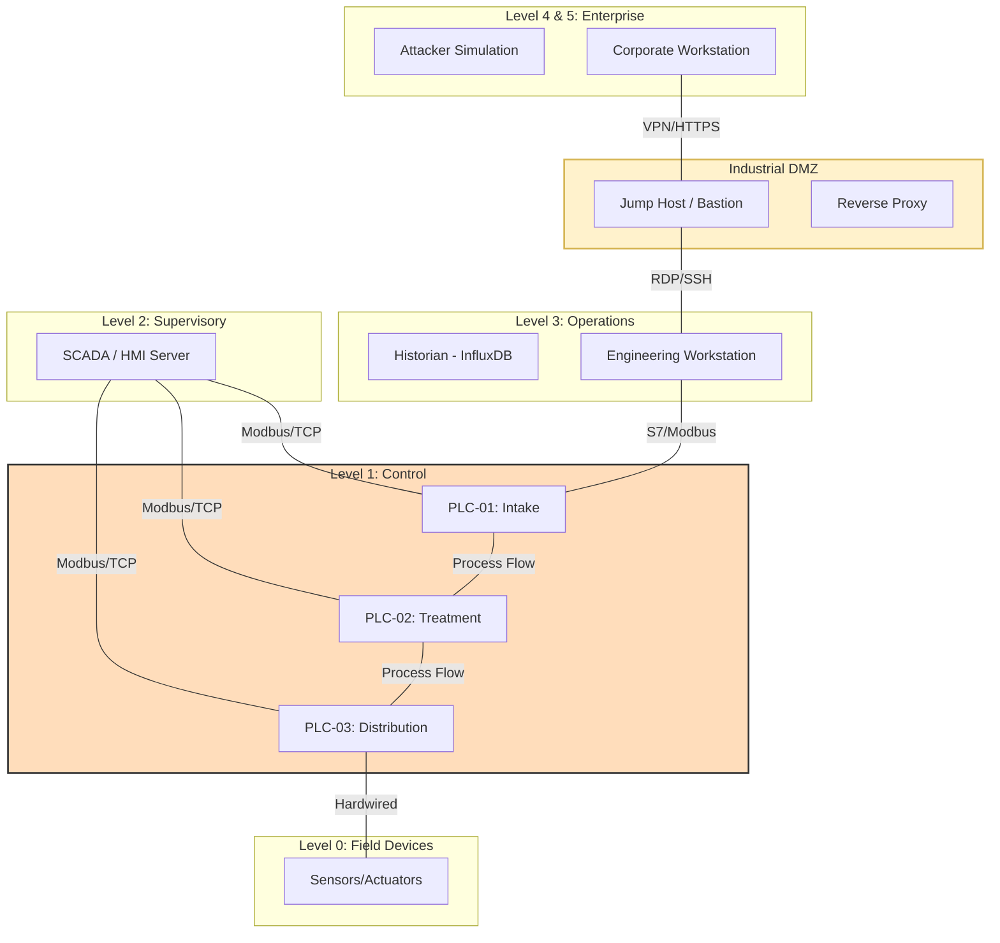
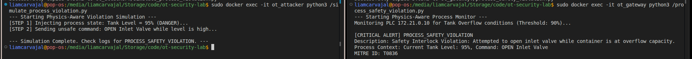
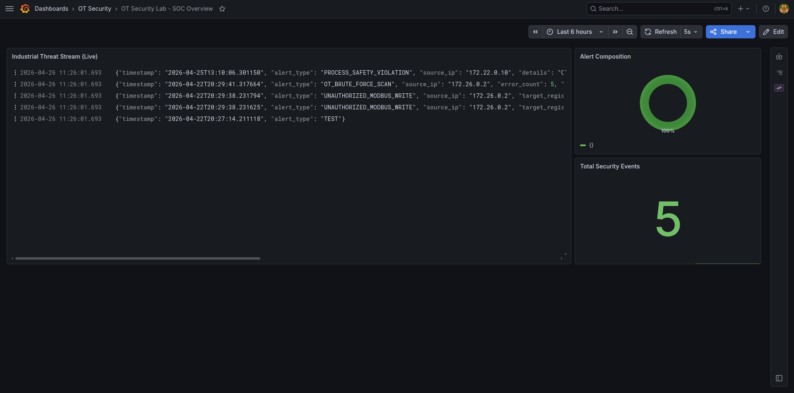
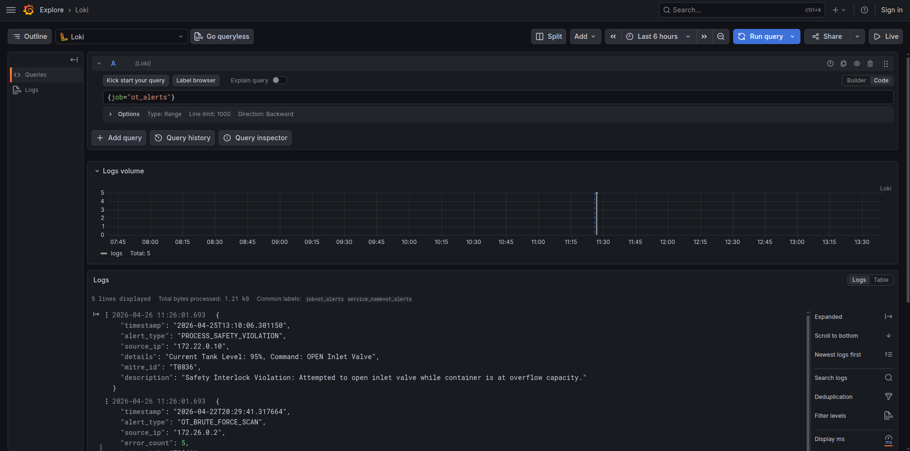

# OT-Security-Lab: Integrated Industrial Control System (ICS) Security Environment

[](./architecture/zone-conduit-design.md)
[](./threat-model/mitre-ics-mapping.md)
[](https://opensource.org/licenses/MIT)

| Category | Specification |
| :--- | :--- |
| **Industry** | Water Treatment & Filtration |
| **Frameworks** | IEC 62443, MITRE ATT&CK for ICS, ISA-95 Purdue Model |
| **Environment** | 5-Zone Segmented Docker Lab with L3/L4 Firewall |
| **Monitoring** | Protocol-Aware (Modbus/TCP) Anomaly detection |
| **Evidence** | [Verified Attack Simulation Logs](./detection/logs/alerts.json) |

## Project Overview
This repository contains a full-scale, simulated industrial environment designed to demonstrate the implementation of robust security controls within an Operational Technology (OT) context. The project encompasses the entire lifecycle of an IT/OT Security Engineer's responsibilities: from **architectural design** and **network segmentation** based on the Purdue Model, to **threat modeling**, **detection engineering**, and **IEC 62443 compliance mapping**.

The lab simulates a **Water Treatment & Filtration Facility**, facilitating a hands-on platform for validating security configurations and detection rules against realistic ICS attack vectors.

---

## 2. Architecture: The Purdue Model
The environment is segmented into logical levels according to the **ISA-95 Purdue Model**, ensuring strict isolation of critical control processes.



### Purdue Levels Mapping:
*   **Level 4/5 (Enterprise):** Corporate LAN, Attacker Simulation, External Monitoring.
*   **Industrial DMZ:** Broker for remote access (Jump Host) and data visualization (Proxy).
*   **Level 3 (Operations):** Historian (InfluxDB) and the segregated Engineering Workstation (EWS).
*   **Level 2 (Supervisory):** Centralized SCADA/HMI (Scada-LTS) for plant-wide visibility.
*   **Level 1 (Control):** Distributed Control via three PLCs (Intake, Treatment, Distribution).
*   **Level 0 (Field):** Physical process assets (Valves, Pumps, Flow Meters).

---

## 3. Table of Contents
1.  [Architecture & Design](./architecture/)
    *   [Network Segmentation (Zones & Conduits)](./architecture/zone-conduit-design.md)
    *   [Architecture Decision Records (ADR)](./architecture/architecture-decisions.md)
2.  [Lab Environment](./lab-environment/)
    *   [Deployment & Validation Guide](./lab-environment/README.md)
    *   [Docker Compose Setup](./lab-environment/docker-compose.yml)
3.  [Asset Inventory](./asset-inventory/)
    *   [Master Asset List](./asset-inventory/assets.csv)
    *   [Inventory Schema](./asset-inventory/inventory-schema.md)
4.  [Threat Model & Risk Analysis](./threat-model/)
    *   [Threat Landscape](./threat-model/THREAT_MODEL.md)
    *   [MITRE ATT&CK for ICS Mapping](./threat-model/mitre-ics-mapping.md)
5. Detection & Monitoring



    * [Modbus Anomaly Detection](./detection/rules/modbus_anomaly.py)
    * [**Physics-Aware Safety Monitor**](./detection/rules/process_safety_violation.py)
    * [Cross-Zone Traffic Alerter](./detection/rules/cross_zone_traffic.py)
    *   [Brute Force Detection](./detection/rules/ot_brute_force.py)
    *   [**Live Detection Evidence (JSON Logs)**](./detection/logs/alerts.json) 
6.  [Hardening & Compliance](./hardening/)
    *   [Security Hardening Checklist](./hardening/HARDENING_CHECKLIST.md)
    *   [IEC 62443 Gap Analysis](./iec62443/gap-analysis.csv)
7.  [Incident Response](./incident-response/)
    *   [PLC Unauthorized Change Playbook](./incident-response/ir-playbook-unauthorised-plc-change.md)
8.  [Engineering Post-Mortem](./LESSONS_LEARNED.md)

### Integrated SIEM Dashboard (Loki & Grafana)


### Forensic Log Analysis (MITRE ATT&CK Mapping)


---

## 4. Key Findings & Engineering Judgments

*   **Tiered Data Architecture (ADR-02):** By isolating the Historian in Level 3 (Operations) rather than Level 2 (Supervisory), we create a unidirectional data flow that prevents corporate IT users from ever reaching the control network directly. This fulfills the **IEC 62443** requirement for restricted data access between functional zones.
*   **Chokepoint Enforcement (ADR-05):** Utilizing a dedicated Linux gateway running `iptables` instead of standard Docker bridge networking allows for granular **L3/L4 traffic control**. This architecture ensures that every inter-zone conduit is explicitly authorized, mirroring the functionality of industrial-grade firewalls.
*   **Availability-First Detection:** Our custom detection rules prioritize **high-signal industrial anomalies** (e.g., Modbus writes from unauthorized IPs) over generic signature matching. This approach minimizes false positives, ensuring that security monitoring does not interfere with the availability of critical industrial processes.

---

## 5. Getting Started
To spin up the entire simulated environment (OpenPLC, HMI, Historian, and Firewall):

```bash
# Clone the repository
git clone https://github.com/yourusername/ot-security-lab.git
cd ot-security-lab/lab-environment

# Start the environment
sudo docker compose up -d

# Apply firewall rules
sudo docker cp network-config/firewall-rules.sh ot_gateway:/firewall-rules.sh
sudo docker exec ot_gateway /firewall-rules.sh
```

---

## 6. Technologies Used
*   **Virtualization:** Docker, Docker Compose V2
*   **Industrial:** OpenPLC Runtime (v4), Scada-LTS (HMI), InfluxDB 1.8 (Historian)
*   **Security Infrastructure:** `iptables` (Zone Firewall), Scapy (Custom IDS), `iputils-ping`, `nmap`
*   **Frameworks:** IEC 62443-3-2 (Zones/Conduits), MITRE ATT&CK for ICS, ISA-95 Purdue Model
*   **Monitoring:** Centralized JSON logging (`alerts.json`)

---

## 7. Known Limitations & Future Work
### Current Limitations:
*   **Logical vs. Physical Data Diode:** Unidirectional flow is enforced via `iptables`. High-consequence sites require hardware-based optical data diodes.
*   **Protocol Scope:** Currently limited to **Modbus/TCP**.
*   **Simulation vs. Emulation:** PLCs are software-simulated (OpenPLC) rather than hardware-emulated.

### Future Roadmap:
*   **SIEM Integration:** Centralized logs using **Grafana, Loki, and Promtail**.
*   **Adversary Emulation:** Developing playbooks for Industroyer and TRITON-style attack simulations.

---

## 8. Compliance Mapping
*   **IEC 62443-3-2:** Zones and Conduits implemented.
*   **MITRE ATT&CK for ICS:** Tactics T0800–T0890 mapped in threat model.
