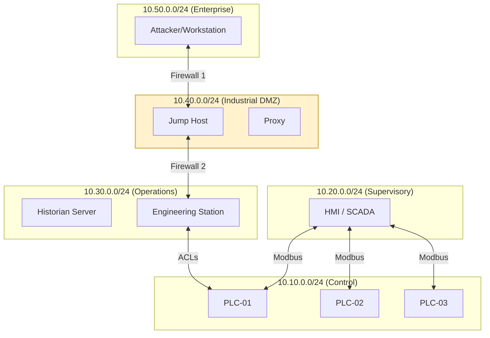

# Network Topology & IP Schema

This document defines the physical-to-logical network mapping for the `ot-security-lab`. We utilize a **Segmented Enclave Architecture** to enforce security boundaries between Purdue Levels.

## 1. Network Segmentation Diagram

## 2. IP Assignment Table

| Primary Asset | Purdue Level | Target IP | Description |
| :--- | :--- | :--- | :--- |
| **Attacker-Sim** | 5 | `10.50.0.100` | Kali/Python Simulation node. |
| **Jump-Host** | DMZ | `10.40.0.5` | Mandatory entry point for remote Maint. |
| **Historian** | 3 | `10.30.0.10` | InfluxDB for process data logging. |
| **Eng-WS** | 3 | `10.30.0.20` | PLC programming (Segregated Enclave). |
| **HMI-Server** | 2 | `10.20.0.50` | ScadaBR Web Interface. |
| **PLC-01** | 1 | `10.10.0.11` | Intake Process Control. |
| **PLC-02** | 1 | `10.10.0.12` | Treatment Process Control. |
| **PLC-03** | 1 | `10.10.0.13` | Distribution Process Control. |

## 3. Firewall Placement Rationale
1.  **IT/OT Boundary (FW1):** Positions Level 3 in a "De-Militarized Zone" (DMZ). Corporate users can pull data from the Historian, but have **zero direct connectivity** to the HMI or PLCs.
2.  **Enclave Protection (FW2):** Protects the Supervisory and Control networks from the Operations zone. Even if the Engineering Station is compromised, the PLC remains isolated behind deep packet inspection (DPI) rules.
