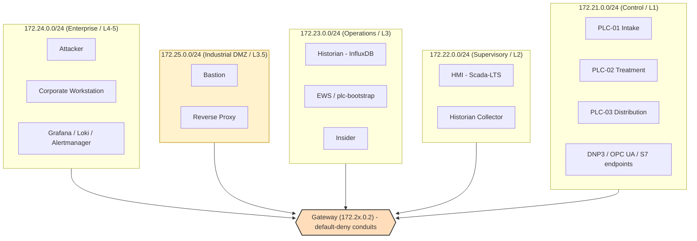

# Network Topology & IP Schema

This document defines the deployed network mapping for the `ot-security-lab`: a
**Segmented Enclave Architecture** that enforces the boundaries between Purdue
levels through a single default-deny gateway.

Addressing is fixed per zone (static `ipv4_address` in
`lab-environment/docker-compose.yml`); the gateway is the only multi-homed
service and every OT host routes cross-zone traffic through it.

## 1. Network Segmentation Diagram

```mermaid
graph TD
    subgraph Enterprise ["172.24.0.0/24 (Enterprise / L4-5)"]
        A[Attacker]
        W[Corporate Workstation]
        SIEM[Grafana / Loki / Alertmanager]
    end

    subgraph DMZ ["172.25.0.0/24 (Industrial DMZ / L3.5)"]
        JH[Bastion]
        RP[Reverse Proxy]
    end

    subgraph Ops ["172.23.0.0/24 (Operations / L3)"]
        C[Historian - InfluxDB]
        D[EWS / plc-bootstrap]
        I[Insider]
    end

    subgraph Supervisory ["172.22.0.0/24 (Supervisory / L2)"]
        E[HMI - Scada-LTS]
        P[Historian Collector]
    end

    subgraph Control ["172.21.0.0/24 (Control / L1)"]
        F1[PLC-01 Intake]
        F2[PLC-02 Treatment]
        F3[PLC-03 Distribution]
        EP[DNP3 / OPC UA / S7 endpoints]
    end

    GW{{"Gateway (172.2x.0.2) - default-deny conduits"}}

    Enterprise --> GW
    DMZ --> GW
    Ops --> GW
    Supervisory --> GW
    Control --> GW

    style DMZ fill:#fff2cc,stroke:#d6b656,stroke-width:2px
    style GW fill:#fdb,stroke:#333,stroke-width:2px
```

## 2. IP Assignment Table

| Primary Asset | Purdue Level | IP | Description |
| :--- | :--- | :--- | :--- |
| **Gateway** | 3.5 | `172.24.0.2` / `172.25.0.2` / `172.23.0.2` / `172.22.0.2` / `172.21.0.2` | Zone firewall + IDS chokepoint (one address per zone). |
| **Attacker** | 4/5 | `172.24.0.10` | Adversary emulation host. |
| **Corporate Workstation** | 4 | `172.24.0.30` | Exercises the DMZ access path. |
| **SIEM** | 4 | `172.24.0.20-24` | Loki, Promtail, Grafana, Alertmanager, webhook. |
| **Reverse Proxy** | 3.5 | `172.25.0.10` | Publishes the operator UI (host `:8080`). |
| **Bastion** | 3.5 | `172.25.0.11` | Jump host for remote maintenance (host `:2222`). |
| **Historian** | 3 | `172.23.0.10` | InfluxDB process historian. |
| **EWS / bootstrap** | 3 | `172.23.0.4` | Deploys PLC program bundles. |
| **Insider** | 3 | `172.23.0.20` | Compromised workstation running protocol clients. |
| **HMI** | 2 | `172.22.0.10` | Scada-LTS operator interface. |
| **Historian Collector** | 2 | `172.22.0.20` | Modbus -> InfluxDB collector. |
| **PLC-01/02/03** | 1 | `172.21.0.10/11/12` | Intake / Treatment / Distribution controllers. |
| **Protocol endpoints** | 1 | `172.21.0.50-52` | DNP3 outstation, OPC UA server, S7comm server. |

## 3. Gateway Placement Rationale
1. **Single chokepoint:** all four OT zones and the boundary zones are bridged
   by exactly one gateway; `tests/test_zone_isolation.py` asserts it is the only
   multi-homed service.
2. **Default-deny, source-restricted conduits:** every permitted flow is
   explicit (see `architecture/zone-conduit-design.md`), and sensitive conduits
   are restricted to a single source host.
3. **Boundary zones:** the Enterprise and DMZ networks are non-internal (so the
   reverse proxy can publish the UI); the OT zones are Docker `internal`
   networks with no host-published ports.
4. **Return-path symmetry:** OT hosts and the controllers carry static routes
   back through the gateway, so detection sees both directions at the chokepoint.
