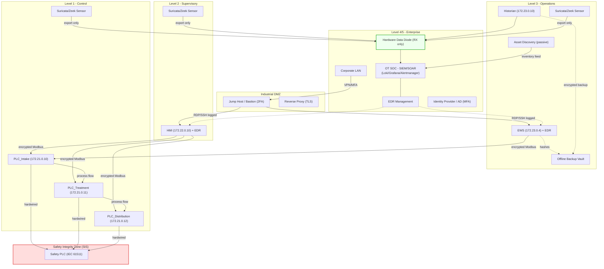

# Target-State Architecture: To-Be Design for OT Security

**Document Owner:** IT/OT Security Architect
**Date:** 2026-08-01
**Current State:** `lab-environment/docker-compose.yml`, `architecture/zone-conduit-design.md`, README.md (Known Limitations & Future Roadmap)
**Target:** IEC 62443 SL-3 for Control (L1) and SL-2 for all other zones; production-grade OT SOC visibility

## 1. Purpose

This document defines the future-state (target) architecture that closes the acknowledged limitations of the current lab: logical unidirectional flow instead of a hardware data diode, Modbus/TCP-only protocol coverage, software-simulated PLCs, gateway-only detection, and no host-level endpoint visibility. The target is a realistic production architecture for a mid-size water utility, phased so each increment delivers measurable security value without a big-bang migration.

## 2. Architecture Principles

1. **Availability first:** no control or safety function may depend on a security appliance that can fail closed into a process outage; all detection is passive or out-of-band.
2. **Safety integrity separated:** the Safety Instrumented System (SIS) function is segregated into its own zone, physically and logically isolated from the control network (IEC 61511 alignment).
3. **Unidirectional by construction:** where data must flow from control to enterprise (historian), a hardware data diode is preferred over firewall rules (currently `iptables`-enforced, per README limitation).
4. **Defense in depth per zone:** every zone gains network-based detection (Suricata/Zeek), host-based detection where supported (EDR on workstations), and centralized correlation.
5. **Identity everywhere:** all access, remote and local, is individually authenticated, with MFA enforced at the perimeter (jump host).

## 3. Target Architecture Diagram

## 4. Phased Implementation Roadmap

| Phase | Timeframe | Scope | Key Deliverables | Success Criteria |
| :--- | :--- | :--- | :--- | :--- |
| **P1 - Resilience** | 0-3 months | Historian backups to offline vault; PLC-side connection limits; HMI/EWS authentication hardening; MOC with logic hash verification | Automated backup jobs (SR_7.3), account lockout/session controls (SR_1.1, SR_2.6), signed logic change process | Restore within RTO in a supervised drill; 100% of SL-2 baseline requirements Implemented |
| **P2 - Visibility** | 3-6 months | Suricata + ET ICS ruleset at gateway; Zeek passive sensors in L2/L3; EDR (Wazuh agent) on EWS and HMI; DNP3 detection expansion | Sensor deployment per zone; alert correlation in Loki/Grafana (172.24.0.20-22); host integrity monitoring (SR_3.1) | All zones covered by network sensor; EDR telemetry correlated with network alerts; detection coverage map complete |
| **P3 - Segmentation** | 6-12 months | SIS zone separation; encrypted control conduits (Modbus/TCP Security or VPN); hardware data diode for historian | Independent safety zone per IEC 61511; encrypted L2/L3-to-L1 conduits (SR_4.1); unidirectional historian ingest | No plaintext control protocol on any conduit; SIS zone isolated with no shared path |
| **P4 - SOC & Identity** | 12-18 months | Full OT SOC runbooks; 2FA remote access (MFA at jump host); centralized identity (LDAP/AD) for SCADA logins; continuous asset discovery | SOC procedures, MFA-enforced remote path, integrated identity (SR_1.1), passive asset discovery feeding `asset-inventory/assets.csv` | 100% of remote sessions MFA-authenticated and logged; asset drift detected within 24 h |
| **P5 - Assurance** | 18-24 months | Adversary emulation (Industroyer/TRITON-style playbooks); annual red team; SL-3 validation of Control zone | Emulation playbooks, re-test reports, updated `iec62443/sl-mapping.md` | Control zone validated at SL-3; detection rules exercised against realistic TTPs |

## 5. Technology Selections (mapped to existing stack)

- **Network IDS:** Suricata with ET ICS ruleset beside the existing Scapy rules (README future roadmap: `siem/suricata/`).
- **Passive sensors:** Zeek per zone (L1/L2/L3) with Modbus/DNP3 analyzers; traffic exports unidirectional to the SIEM.
- **Host EDR:** Wazuh agent on EWS (172.23.0.4) and HMI (172.22.0.10), correlated with network alerts (README future roadmap).
- **Asset discovery:** continuous passive discovery tool (Zeek-based or commercial) replacing manual inventory, feeding the inventory schema.
- **Data diode:** hardware optical data diode between L3 historian export and the enterprise SIEM; until procurement, the `iptables`-enforced one-way flow remains the compensating control.
- **Identity:** central LDAP/Active Directory integrated with Scada-LTS and EWS authentication; MFA at the DMZ jump host.
- **SIEM/SOC:** retain Loki 3 + Grafana 11 + Alertmanager (172.24.0.20-23) as the correlation core, extended with SOAR-lite webhook (172.24.0.24) playbook automation.

## 6. Gap Closure vs Current Architecture

| Current Limitation (README) | Target-State Resolution | Phase |
| :--- | :--- | :--- |
| Logical (iptables) unidirectional flow | Hardware optical data diode | P3 |
| Detection only for Modbus/TCP + DNP3 | Suricata ET ICS + Zeek analyzers per zone | P2 |
| Software-simulated PLCs | (Lab constraint) physical HIL/field devices in production rollout | P5 |
| No host-level visibility | EDR on EWS/HMI; host integrity (SR_3.1) | P2 |
| Single chokepoint gateway | Defense-in-depth: per-zone sensors + EDR + MFA identity | P2-P4 |
| Manual asset inventory | Passive asset discovery feeding inventory CSV | P4 |

## 7. Risks and Assumptions

- **Data diode assumption:** historian export must be acyclic (polling/collection only); live two-way historian queries move to a diode-crossing service or remain on the control side.
- **SIS isolation** may conflict with legacy PLC design; requires engineering assessment of hardwired interlocks before implementation.
- **Encrypted Modbus** requires end-device support (OpenPLC/field devices); interim mitigation is VPN tunneling at the conduit.
- Phases P3-P5 carry capital cost; approval gates require updated BIA (Section 3) justification.

---

**Approved By:** OT Security Director / Plant Manager
**Next Review:** at each phase gate (P1 at 3 months)
