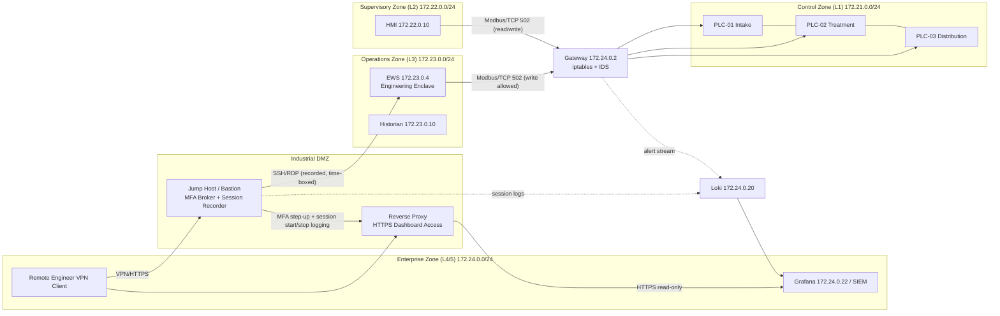

# OT Remote Access Design: DMZ Jump Host Pattern

**Scope:** OT-Security-Lab — simulated Water Treatment & Filtration facility
**Reference Standards:** IEC 62443-3-3 (Foundational Requirements FR2/FR4, SR 2.x/4.x),
IEC 62443-3-2 (zones and conduits), NIST SP 800-82 Rev 3 (remote access section)
**Related Lab Evidence:** ADR-04 (iDMZ), conduit C3 in `architecture/zone-conduit-design.md`,
`governance/standards/REMOTE_ACCESS_DESIGN.md` (this document)

---

## 1. Design Objectives

Remote access is the single most exploited entry path into OT environments (stolen VPN
credentials, unpatched jump hosts, dual-hop pivots). The design objectives are:

1. **No direct session** between the enterprise network (L4/5, 172.24.0.0/24) and any OT zone.
2. **All remote access terminates in the DMZ** and a new session is initiated onward (break-in-communication).
3. **Every session is authenticated, authorized, time-boxed, and recorded.**
4. **Privileged engineering actions require the highest assurance path** (EWS enclave, per ADR-03).

## 2. Current Lab Baseline (As-Is)

The lab already implements the network skeleton of this pattern:

| Component | Lab Asset | Address |
| :--- | :--- | :--- |
| Enterprise zone | Attacker / corporate simulation, SIEM tier | 172.24.0.0/24 |
| Industrial DMZ | Jump host + reverse proxy (documented pattern, ADR-04) | DMZ segment |
| Operations zone | EWS (172.23.0.4), Historian (172.23.0.10) | 172.23.0.0/24 |
| Supervisory zone | HMI / Scada-LTS | 172.22.0.10 |
| Control zone | PLC-01/02/03 (OpenPLC) | 172.21.0.10/11/12 |
| Gateway chokepoint | iptables firewall + IDS | 172.24.0.2 |

As-is gaps: no live MFA broker, no session recording, no time-based access enforcement.
These are the target components of the to-be design below.

## 3. IEC 62443-3-3 Requirements Covered (SR 2.x)

| Requirement | Title | Design Coverage |
| :--- | :--- | :--- |
| SR 2.1 | Authorization enforcement | Every remote user maps to a role (operator/engineer/administrator); roles map to zone reach sets and command capabilities (e.g., only EWS may write to PLCs) |
| SR 2.2 | Wireless use control | N/A in lab (wired topology); policy prohibits wireless jumps into OT zones |
| SR 2.3 | Use control for portable/mobile devices | Engineering laptop connects only to jump host; no direct OT network attachment |
| SR 2.4 | Mobile code | Web-based HMI/Grafana access proxied through DMZ reverse proxy only |
| SR 2.5 | Session locking | HMI sessions lock on inactivity; jump host enforces idle timeout |
| SR 2.6 | Remote session termination | Time-based access windows + session duration caps; forced termination at window expiry |
| SR 2.7 | Concurrent session control | One active engineering session per account (session takeover prevention) |
| SR 2.9 | Audit log for access | Jump host and gateway forward all session events (start, commands, end) to Loki |
| SR 2.11 | Password management / MFA | MFA enforced on the jump host for all OT-bound sessions |
| SR 4.2 | Information persistence / confidentiality | Session recordings encrypted at rest in the logging tier; credentials never stored on the jump host |

## 4. To-Be Architecture



ASCII equivalent:

```
[Remote Engineer] --VPN--> [DMZ: Jump Host (MFA, recorder)] --SSH/RDP--> [EWS L3]
                                     |
                                     |--HTTPS--> [DMZ: Reverse Proxy] --> [Grafana L4]
[Session logs + alerts] --> [Loki] --> [Grafana SIEM]
[EWS/HMI] --> [Gateway 172.24.0.2: iptables + IDS] --> [PLCs 172.21.0.10/11/12]
```

## 5. Control Components and Lab Mapping

| Component | Function | To-Be Implementation | Lab Evidence / Base |
| :--- | :--- | :--- | :--- |
| **DMZ jump host** | Single entry point; all OT-bound sessions terminate here | Hardened bastion with `cap_drop: ALL`, minimal packages, auditd | Pattern per ADR-04; gateway container hardening precedent in `governance/hardening/LINUX_OT_GATEWAY_STIG.md` |
| **MFA broker** | Step-up authentication for engineers | TOTP or hardware-token check on the jump host before a session opens | Policy requirement mapped to SR 2.11; documented in `REMOTE_ACCESS_DESIGN.md` |
| **Session logging / recording** | Capture every command and session frame | Record SSH/RDP sessions; stream event log to Loki (172.24.0.20) via Promtail | Promtail/Loki pipeline already operational; extend `siem/configs/promtail-config.yaml` |
| **Time-based access** | Access only during approved windows | Jump host enforces schedule per user; session duration caps; SR 2.5/2.6 | Gap closed by policy + jump-host enforcement; gateway rules stay default-deny outside windows |
| **Reverse proxy** | Read-only dashboard visibility without OT exposure | HTTPS proxy to Grafana; no protocol other than HTTPS crosses the DMZ | Conduit C3 requirement in `architecture/zone-conduit-design.md` |
| **Chokepoint enforcement** | All traffic still must traverse the gateway | iptables default-deny unchanged; IDS rules (CROSS_ZONE_VIOLATION T0886) remain the tripwire for any bypass attempt | `detection/rules/cross_zone_traffic.py`, ADR-05 |

## 6. Access Decision Flow (Operational Procedure)

1. Engineer requests access window (ticketing; MOC approval required for PLC writes).
2. Jump host validates: user active, MFA enrolled, window open, role permits target zone.
3. Session opens; every command streamed to Loki; alerts.json-class events (e.g., an
   unauthorized write attempt) trigger Alertmanager -> webhook notification.
4. Window expiry or idle timeout terminates the session (SR 2.5, SR 2.6).
5. Audit review: session logs correlated with detection alerts in Grafana dashboards.

## 7. Known Limitations and Next Steps

- The lab has no production MFA broker or session recorder; the design is implemented as
  a documented pattern plus the DMZ skeleton (ADR-04). A future lab addition would be a
  bastion container with a TOTP plugin and `script`/SSH session capture.
- Grafana anonymous access (demo convenience) must be replaced with authenticated access
  before this pattern is production-representative.
- Physical isolation and hardware tokens are out of scope for a Docker-based lab.
