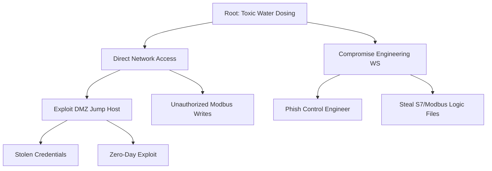

# OT Security Lab: Threat Model & Risk Assessment

This document outlines the high-level risks to our Water Treatment Facility and the actors who might attempt to compromise it.

## 1. Asset Inventory & Criticality
| Asset ID | Name | Primary Function | Security Priority |
| :--- | :--- | :--- | :--- |
| **PLC-01** | Intake PLC | Control water inflow | **Safety & Availability** |
| **PLC-02** | Treatment PLC| Control chemical dosing| **Safety (Critical)** |
| **HMI-01** | Main SCADA | Human monitoring/control | **Integrity** |
| **Hist-01** | Historian | Long-term audit/data | **Availability & Compliance** |

## 2. Threat Actor Profiles
1. **State-Sponsored APT (External):** High resource, high skill. Focuses on **kinetic impact** (Safety/Availability). Target: Level 1.
2. **Disgruntled Insider (Internal):** High access, medium skill. Focuses on **process disruption** or sabotage. Target: Level 1/2.
3. **Ransomware Operator (External):** Low OT skill, high automation. Focuses on **monetary gain** via encryption. Target: Level 3/4.

## 3. High-Priority Risk Scenarios

### Scenario 1: Lateral Movement & Chemical Dosing (The APT)
- **Vector:** Phishing (L4) -> Jump Host (DMZ) -> EWS (L3) -> PLC-02 (L1).
- **Action:** Attacker sends malicious Modbus write commands to PLC-02 to increase chemical levels.
- **Impact:** **Safety (Critical)** - Toxic water distribution.

### Scenario 2: Remote Access Hijack (The Insider)
- **Vector:** Stolen VPN credentials.
- **Action:** Unauthorized login to the HMI to stop the Intake pump (PLC-01).
- **Impact:** **Availability (High)** - Water shortage for the facility.

### Scenario 3: Historian Ransomware (The Extortionist)
- **Vector:** Vulnerable web-interface on Level 3.
- **Action:** Encrypts the InfluxDB database.
- **Impact:** **Compliance & Operations (Medium)** - Loss of regulatory data.

## 4. Attack Tree (Visualized as Code)

